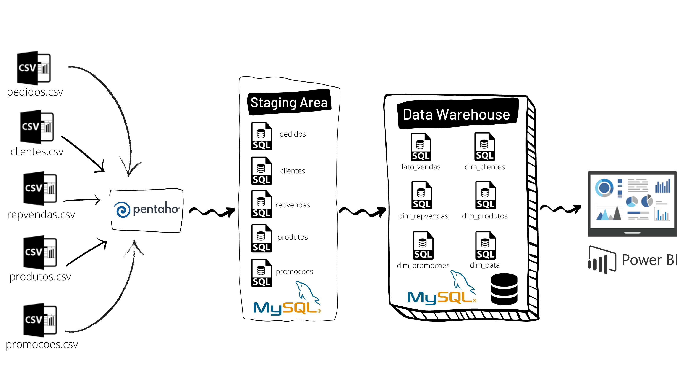

# ETL no Pentaho Data Integration

## Introdução

Trata-se de um projeto para praticar ETL com Pentaho, modelagem de dados com MySQL e desenvolvimento de dashboard com Power BI.

Esse projeto ajuda o time de analytics da startup GuinhaEletro analisando seus dados de vendas.

## Data Schema e ETL Pipeline

### Data Schema

Utilizando as tabelas de pedidos, clientes, representantes de vendas, produtos e promoções foi criado um star schema como apresentado abaixo, que inclui

- Uma tabela fato: **fato_vendas**, e 
- Cinco tabelas dimensões: **dim_clientes**, **dim_repvendas**, **dim_produtos**, **dim_promocoes** e **dim_data**.

### ETL Pipeline

O ETL pipeline extrai os dados dos arquivos .csv e faz a inserção nas tabelas da base `st_area`, sendo nossa staging area.

A partir das tabelas que chegam na staging area serão feitas as devidas transformações nos dados e criação das tabelas do Data Warehouse, sendo armazenadas na base `dw`.

Ambas as bases de dados foram criadas no  banco de dados relacional, MySQL.

Com isso, foi construído um dashboard no Power BI, para realização das análises desejadas.

Abaixo temos um diagrama representativo do que foi descrito acima.

## Como executar

### Pré-requisitos

Se você deseja executar o projeto em sua máquina, você deve concluir os seguintes passos primeiro.

- Instalar o Pentaho Data Integration
- Instalar o MySQL
- Instalar o Power Bi

### Instruções

1. Crie um workspace com o nome que você desejar
2. Crie as bases de dados tabelas executando copiando e colando o código do arquivo `criar_tabelas.sql` para dentro do MySQL e executando
3. Crie duas conexões com as mesmas configurações de localhost, porta, usuário e senha, mudando apenas o nome da conexão, sendo uma `st_area` e outra `dw`
4. Execute o job `ETL.kjb`
5. Confira o resultado do processo: Execute as queries, individualmente, do arquivo `teste.sql` no MySQL para visualizar se os dados foram registrados corretamente nas tabelas
6. Dashboard

## Arquivos do Projeto

- **data**
  - **pedidos.csv**
    - dados dos pedidos realizados
  - **repvendas.csv**
    - dados dos representantes de vendas
  - **produtos.csv**
    - dados dos produtos oferecidos
  - **promoções.csv**
    - dados das promoções relacionadas aos produtos
  - **clientes.csv**
    - dados dos clientes da empresa
- **images**
  - Imagens do documento
 - **transformations**
   - **importa_csv.ktr**
     - transformação que extrai os dados dos arquivos .csv e insere os resultados nas tabelas da base st_area
   - **dim_clientes.ktr**
     - transformação que realiza o processamento da tabela de clientes e insere os resultados na tabela dim_cliente na base dw
   - **dim_data.ktr**
     - transformação que cria e insere dados relacionados a datas na tabela dim_data na base dw
   - **dim_produtos.ktr**
     - transformação que realiza o processamento da tabela de produtos e insere os resultados na tabela dim_produtos na base dw
   - **dim_promocoes.ktr**
     - transformação que realiza o processamento da promoções dos produtos e insere os resultados na tabela dim_promocoes na base dw
   - **dim_repvendas.ktr**
     - transformação que realiza o processamento da tabela de representates de vendas e insere os resultados na tabela dim_repvendas na base dw
   - **fato_vendas.ktr**
     - transformação que realiza o processamento da tabela de pedidos e insere os resultados na tabela fato_vendas
- **jobs**
  - **ETL.kjb**
    - Job que executa todas transformações
- **README.md**
  - Descrição e instruções sobre o projeto.
- **criar_tabelas.sql**
  - Quando executado, esse script irá
    - `drop` database `st_area`
	- `drop` database `dw`
    - `create` database `st_area`
	- `create` database `dw`
    - `drop` tables if exists
    - `create` tables if not exists
- **teste.sql**
  - Queries para testar se as tabelas foram populadas corretamente.
- **painel_vendas.pbix**
  - Dashboard com as análises realizadas.

## Referencias: 

- Workshop ETL ao DW do Leonardo Toledo (https://youtu.be/0dyz-v31ZdY).
- Como criar um dashboard completo no Power do Gerson - Minhas Planilhas (BIhttps://youtu.be/YyrK_1RDxv0).
